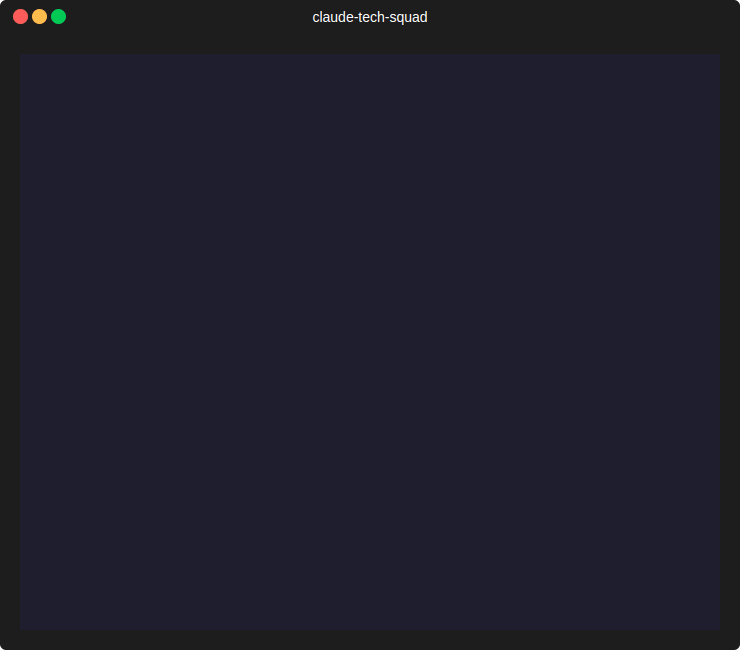

# claude-tech-squad

Installable Claude Code plugin for a complete software delivery squad.



This repository is the execution layer. It provides the specialist team and workflows that run inside a real repository.

## Use This Repository For

- discovery, scope shaping, and release slicing
- architecture, TDD-first implementation planning, and execution coordination
- coordinated delivery across backend, frontend, data, platform, QA, security, docs, and release
- LLM/AI features: evals as CI gate, prompt review, RAG quality, prompt injection security
- Jira and Confluence handoff support

See [GETTING-STARTED.md](docs/GETTING-STARTED.md) for installation, teammate mode setup, commands, and prompt examples.
See [SKILL-SELECTOR.md](docs/SKILL-SELECTOR.md) for the decision tree: which skill to run for each situation.
See [EXECUTION-TRACE.md](docs/EXECUTION-TRACE.md) for how to interpret visible agent execution.
See [OPERATIONAL-PLAYBOOK.md](docs/OPERATIONAL-PLAYBOOK.md) for common execution scenarios.
See [DOGFOODING.md](docs/DOGFOODING.md) for layered, hexagonal, and hotfix smoke scenarios.
See [GOLDEN-RUNS.md](docs/GOLDEN-RUNS.md) for real-run capture and scorecard validation.
See [ENGINEERING-OPERATING-SYSTEM.md](docs/ENGINEERING-OPERATING-SYSTEM.md) for the governance model used to run this plugin like an engineering organization.
See [CONTRIBUTING.md](CONTRIBUTING.md) and [SECURITY.md](SECURITY.md) for contribution and vulnerability-handling rules.
See [RELEASING.md](docs/RELEASING.md) for the official GitHub Actions publish path from `main`, including automatic semver, changelog, manifest, and manual updates.
See [HOW-TO-CHANGE-AND-PUBLISH.md](docs/HOW-TO-CHANGE-AND-PUBLISH.md) for the operator checklist when changing the plugin and shipping a new version.
Run `bash scripts/dogfood.sh` to validate the local dogfooding pack and `bash scripts/dogfood.sh --print-prompts` to print the fixture prompts.
Run `bash scripts/dogfood-report.sh --schema-only` to validate the golden-run contract and `bash scripts/dogfood-report.sh` when real runs are available under `ai-docs/dogfood-runs/`.
Run `bash scripts/start-golden-run.sh <scenario-id> <operator>` to scaffold a real golden-run capture.

## What This Repository Contains

- one Claude Code marketplace manifest
- one installable plugin: `claude-tech-squad`
- 74 specialist agents for software delivery
- 20 skills covering discovery, implementation, LLM evals, security, distributed systems, and more
- one central runtime policy: `plugins/claude-tech-squad/runtime-policy.yaml`
- one local dogfooding pack plus golden-run contract

## Pick the Right Skill

Not sure which skill to run? Answer these four questions:

| Question | Answer → Skill |
|---|---|
| Is this your **first time** in this repository? | → `/onboarding` |
| Is **production broken right now**? | → `/hotfix` (known location) or `/cloud-debug` (need to investigate) |
| Do you have an **open PR** to review? | → `/pr-review` |
| Do you want to **build a feature** end-to-end? | → `/squad` (full pipeline) or `/discovery` (blueprint only) then `/implement` |

For less common situations — refactor, security audit, migration, LLM eval, multi-service — see [SKILL-SELECTOR.md](docs/SKILL-SELECTOR.md).

> **Stack is detected automatically.** You never need to specify Django, React, Vue, TypeScript, JavaScript, or Python — the skill detects it at preflight and routes to the right specialist.

> **LLM/AI bench activates automatically.** `/squad`, `/implement`, and `/security-audit` detect AI code (OpenAI, Anthropic, LangChain, pgvector) and add the AI specialist bench without extra configuration.

## Commands

```bash
# Core delivery
/claude-tech-squad:discovery   # shape the problem and produce a blueprint
/claude-tech-squad:implement   # build from an approved blueprint
/claude-tech-squad:squad       # end-to-end: discovery + implementation + release

# Emergency & incidents
/claude-tech-squad:hotfix              # emergency production fix
/claude-tech-squad:incident-postmortem # blameless post-mortem

# Quality & security
/claude-tech-squad:pr-review      # full specialist bench review on any PR
/claude-tech-squad:security-audit # static analysis + secrets scan + CVE check
/claude-tech-squad:refactor       # test-guarded incremental refactoring

# LLM / AI specific
/claude-tech-squad:llm-eval      # run eval suite as CI gate — detect regressions before deploy
/claude-tech-squad:prompt-review # review prompt changes: regression, injection, token cost

# Release & planning
/claude-tech-squad:release          # cut a release with rollback plan and CI gate
/claude-tech-squad:migration-plan   # safe database migration planning with backup gate
/claude-tech-squad:dependency-check # CVEs, supply chain, outdated packages
/claude-tech-squad:cloud-debug      # investigate production incidents

# Distributed systems & infrastructure
/claude-tech-squad:multi-service # coordinate changes across multiple services with contract testing
/claude-tech-squad:iac-review    # review IaC changes before apply: blast radius, security, cost

# Project setup
/claude-tech-squad:onboarding         # bootstrap any new repo for squad usage
/claude-tech-squad:factory-retrospective # analyze executions and improve the process
```

## Teammate Mode (tmux panes)

By default, agents run inline as subagents. To make each specialist open in its own tmux pane, enable teammate mode.

**Requires:**
1. Starting Claude Code inside a tmux session
2. Two environment variables configured in `~/.claude/settings.json`

Configuration:

```json
{
  "env": {
    "CLAUDE_CODE_EXPERIMENTAL_AGENT_TEAMS": "1",
    "CLAUDE_CODE_TEAMMATE_MODE": "tmux"
  }
}
```

Starting Claude Code inside tmux:

```bash
tmux new-session -s squad
claude
```

With teammate mode active, each `/discovery`, `/implement`, and `/squad` call creates a team and spawns every specialist in a separate pane. Without tmux mode, the same workflows run correctly as inline subagents.

## Visible Orchestration

The workflows expose squad execution in the Claude output.

You should see:

- `[Preflight Passed] discovery | execution_mode=... | ... | runtime_policy=...`
- `[Team Created] discovery` or `[Team Created] squad`
- `[Teammate Spawned] pm | pane: pm`
- `[Checkpoint Saved] discovery | cursor=...`
- `[Resume From] implement | checkpoint=...`
- `[Fallback Invoked] reviewer -> claude-tech-squad:code-quality | Reason: ...`
- `[Gate] Scope Validation | Waiting for user input`
- `[Batch Spawned] specialist-bench | Teammates: backend-arch, frontend-arch, api-designer`
- `[Teammate Done] reviewer | Status: APPROVED`
- `[AI Detected] LLM/AI features found — activating AI specialist bench`
- a final `Agent Execution Log` in the result

See [EXECUTION-TRACE.md](docs/EXECUTION-TRACE.md) for interpretation guidance.

## Install

```bash
claude plugin marketplace add alexfloripavieira/claude-tech-squad
claude plugin install -s user claude-tech-squad@alexfloripavieira-plugins
```

## Usage

```bash
/claude-tech-squad:discovery describe the feature or initiative
/claude-tech-squad:implement
/claude-tech-squad:squad describe the full delivery request

# For LLM/AI projects
/claude-tech-squad:llm-eval      # after any prompt or RAG pipeline change
/claude-tech-squad:prompt-review # before merging any prompt file change
```

## Specialist Roster (74 agents)

### Discovery & Planning
- PM
- Business Analyst
- PO
- Planner
- Architect
- Tech Lead

### Architecture Specialists
- Backend Architect
- Hexagonal Architect
- Frontend Architect
- API Designer
- Data Architect
- UX Designer
- AI Engineer
- Agent Architect
- Integration Engineer
- DevOps
- CI/CD
- DBA
- Platform Dev
- Cloud Architect

### LLM / AI Specialists
- AI Engineer *(model pinning, context budget, streaming failure handling, multi-modal inputs, output validation, agent loop safety)*
- Prompt Engineer *(design, token optimization, caching, versioning, injection defense)*
- RAG Engineer *(full pipeline + RAGAS quality gates + knowledge base poisoning prevention)*
- LLM Eval Specialist *(RAGAS, DeepEval, PromptFoo, hallucination detection, LLM-as-judge)*
- LLM Safety Reviewer *(prompt injection direct + indirect, jailbreak, tool call auth, PII leakage)*
- LLM Cost Analyst *(token cost attribution per feature/user, model downgrade recommendations, caching ROI, spend anomaly detection)*
- Agent Architect *(multi-agent orchestration, MCP, tool use design, loops with termination)*
- Conversational Designer
- ML Engineer

### Implementation
- Backend Dev
- Frontend Dev
- Mobile Dev
- Data Engineer
- TDD Specialist

### Search
- Search Engineer

### Quality & Review
- Reviewer
- QA
- Test Planner
- Test Automation Engineer
- Integration QA

### Specialist Reviewers
- Security Reviewer *(includes LLM threat surface checks)*
- Security Engineer
- Privacy Reviewer
- Compliance Reviewer
- Accessibility Reviewer
- Performance Engineer
- Chaos Engineer
- Design Principles Specialist
- Code Quality

### Observability & Monitoring
- Observability Engineer
- Monitoring Specialist
- Analytics Engineer

### Design
- Design System Engineer

### Documentation & Developer Experience
- Docs Writer
- Tech Writer
- DevEx Engineer
- Jira and Confluence Specialist
- Developer Relations

### Operations & Release
- Release
- SRE
- Cost Optimizer
- Incident Manager

### Business & Growth
- Solutions Architect
- Growth Engineer

### Stack Specialists

Django stack:

- `django-pm` — Product Manager for Django web projects. Shapes the problem, writes user stories, validates delivered features with UAT (Context7 + Playwright).
- `tech-lead` — Technical lead for Django projects. Defines the approach, decomposes work into agent slices, validates technology choices via Context7. Does not write production code.
- `django-backend` — Implements Django models, views, forms, URLs, admin, migrations, ORM queries, and API endpoints. Context7 for all Django/DRF lookups. TDD-first.
- `django-frontend` — Implements Django Template Language templates and TailwindCSS layouts. Context7 for DTL/Tailwind lookups. Playwright for visual verification.
- `code-reviewer` — Reviews Django backend and frontend code for correctness, N+1 queries, auth gaps, CSRF, TDD compliance, and lint. Returns APPROVED or CHANGES REQUESTED.
- `qa-tester` — Validates delivered features in the running application using Playwright. Functional flows, responsive design, console health. Does not modify application code.

React / Vue stack:

- `react-developer` — Implements React components, hooks, state management, and Django backend integration. Context7 + Playwright.
- `vue-developer` — Implements Vue 3 SFCs using the Composition API, Pinia, Vue Router, and Django backend integration. Context7 + Playwright.

Python stack:

- `python-developer` — Implements Python utilities, CLI tools, Celery tasks, and service integrations outside the Django web layer. Context7 for all library lookups. TDD-first.

TypeScript / JavaScript stack:

- `typescript-developer` — Implements TypeScript modules, type definitions, and SDK clients. Strict type safety. Context7. Playwright for bundle verification.
- `javascript-developer` — Implements vanilla JavaScript browser scripts and Node.js utilities in non-TypeScript projects. Context7 + Playwright.

Shell / Automation stack:

- `shell-developer` — Writes shell scripts for automation, CI/CD, deployment, and developer tooling. `set -euo pipefail` enforced. Context7 for CLI tool lookups.

**MCP coverage for stack specialists:**

| Agent | Context7 | Playwright |
|---|---|---|
| django-pm | ✅ | ✅ (UAT) |
| tech-lead | ✅ | — |
| django-backend | ✅ | — |
| django-frontend | ✅ | ✅ (visual verification) |
| code-reviewer | — | — |
| qa-tester | — | ✅ (full E2E) |
| react-developer | ✅ | ✅ (visual verification) |
| vue-developer | ✅ | ✅ (visual verification) |
| python-developer | ✅ | — |
| typescript-developer | ✅ | ✅ (bundle check) |
| javascript-developer | ✅ | ✅ (browser verification) |
| shell-developer | ✅ (CLI tools) | — |

**Stack routing — resolved automatically at skill preflight:**

| Routing variable | Django | React | Vue | TypeScript | JavaScript | Python | Generic |
|---|---|---|---|---|---|---|---|
| `{{backend_agent}}` | `django-backend` | `backend-dev` | `backend-dev` | `backend-dev` | `backend-dev` | `python-developer` | `backend-dev` |
| `{{frontend_agent}}` | `django-frontend` | `react-developer` | `vue-developer` | `typescript-developer` | `javascript-developer` | `frontend-dev` | `frontend-dev` |
| `{{reviewer_agent}}` | `code-reviewer` | `reviewer` | `reviewer` | `reviewer` | `reviewer` | `reviewer` | `reviewer` |
| `{{qa_agent}}` | `qa-tester` | `qa-tester` | `qa-tester` | `qa-tester` | `qa-tester` | `qa` | `qa` |

Skills that use this routing: `/squad`, `/implement`, `/discovery`, `/bug-fix`, `/hotfix`, `/refactor`, `/pr-review`.

**Recommended delivery order for a full Django feature:**

```
django-pm → tech-lead → django-backend → django-frontend → code-reviewer → qa-tester
```

Testing split:

- Test Planner defines the coverage contract
- TDD Specialist defines red-green-refactor delivery cycles
- QA validates acceptance criteria and regressions after cycles pass

Security split:

- Security Reviewer audits existing code for vulnerabilities (includes LLM-specific checks)
- Security Engineer implements security features (OAuth2, MFA, WAF, SAST/DAST)
- LLM Safety Reviewer covers AI-specific attack surface (prompt injection, jailbreak, tool abuse)

Documentation split:

- Docs Writer produces internal developer and operator documentation
- Tech Writer produces external user guides, public API references, and customer changelogs
- Developer Relations owns external developer community, SDKs, and technical content

Architecture split:

- Architect owns overall solution design, cross-cutting concerns, and workstream decomposition
- Backend Architect owns the backend-specific slice (APIs, services, auth, persistence) within the chosen architecture style
- Hexagonal Architect owns the port/adapter depth when Hexagonal Architecture is selected

Code review split:

- Reviewer audits individual PRs for correctness, TDD compliance, lint, and architecture boundary adherence
- Code Quality owns the strategic quality baseline: lint configuration, coding standards, tech debt trends, and quality metrics across the codebase

## LLM / AI Project Workflow

When `/squad` detects LLM/AI code in the repository (OpenAI, Anthropic, LangChain, LlamaIndex, pgvector, etc.), it automatically activates the full AI specialist bench:

```
/squad "feature with AI"
    │
    ├─ [AI Detected] → activates AI specialist bench
    │
    PHASE 1 — Discovery
    ├─ + ai-engineer       (model design, context budget, streaming, multi-modal, eval strategy)
    ├─ + rag-engineer      (retrieval pipeline, if RAG detected)
    ├─ + prompt-engineer   (prompt architecture, injection defense)
    ├─ + llm-eval-specialist (golden dataset, regression thresholds)
    ├─ + llm-safety-reviewer (threat model: injection, jailbreak, tool auth)
    └─ + llm-cost-analyst  (token cost attribution, model routing, caching ROI)
    │
    PHASE 2 — Quality Bench
    ├─ + llm-safety-reviewer (injection surface + tool authorization review)
    └─ + llm-eval gate (runs evals before UAT — blocks if regression detected)
```

For LLM-specific workflows outside of full squad runs:

```bash
# After any prompt change
/claude-tech-squad:prompt-review

# Before any release touching AI features
/claude-tech-squad:llm-eval

# Security audit of LLM attack surface
/claude-tech-squad:security-audit  # includes llm-safety-reviewer
```

## Safety Guardrails

Every skill carries a **Global Safety Contract** (v5.8.0+). Every agent with execution authority carries an **Absolute Prohibitions** block. These are hard-coded constraints that cannot be overridden by incident urgency, deadlines, or business pressure.

Forbidden without explicit written user confirmation (across all agents):

- `DROP TABLE`, `DROP DATABASE`, `TRUNCATE` — any destructive SQL
- `tsuru app-remove`, `heroku apps:destroy`, or any cloud resource deletion in production
- Merging to `main`, `master`, or `develop` without an approved pull request
- `git push --force` to any protected branch
- `git commit --no-verify` — skipping pre-commit hooks
- Removing secrets or environment variables from production
- Deploying to production without staging verified first
- Creating a release tag when CI is failing
- Applying migrations without a confirmed backup
- Deploying to production without a documented and tested rollback plan
- Disabling authentication, authorization, monitoring, or SLO alerting
- Running chaos experiments in production without maintenance window, on-call, and abort procedure
- Publishing to App Store or Play Store production track without a staged rollout

Additional safety for LLM features:

- Prompt injection vulnerabilities are blocking — no merge until fixed
- Tool calls with destructive actions require an explicit human-in-the-loop gate
- PII must not be passed to LLMs or eval services without masking
- Model version must be pinned — never use floating model aliases in production
- Auto-updating prompts without eval regression testing is prohibited

## Documentation Standard

Every agent in the squad should use **Context7** first when it is available to look up current documentation before using any library, framework, or external API — regardless of stack. If Context7 is unavailable, the fallback is repository evidence, local installed docs, and explicit assumptions in the output. Training data is never the source of truth for API signatures or method behavior.

Mandatory workflow for every library used:

```
mcp__plugin_context7_context7__resolve-library-id("library-name")
mcp__plugin_context7_context7__query-docs(libraryId, topic="specific feature")
```

Applies to: npm, PyPI, Go modules, Maven, cloud SDKs (AWS, GCP, Azure), frameworks (Django, React, Spring, Rails), database drivers, and any third-party integration. If Context7 is unavailable or does not have documentation for the library, the agent must declare it explicitly and flag assumptions.

## Validation and Release

- Validation workflow: [validate.yml](.github/workflows/validate.yml)
- Validation script: [validate.sh](scripts/validate.sh)
- Release process: [RELEASING.md](docs/RELEASING.md)
- Changelog: [CHANGELOG.md](CHANGELOG.md)
